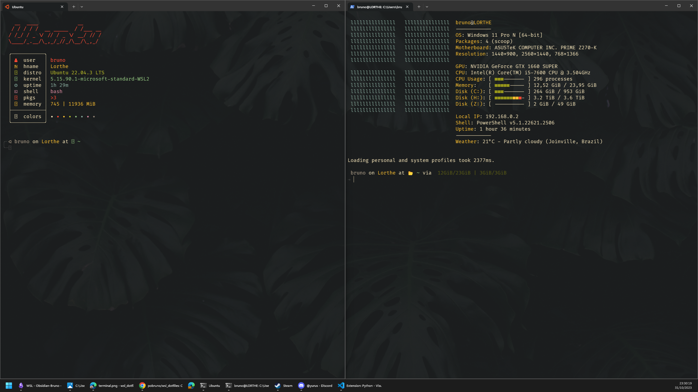

# Configs for my Windows Terminal, PowerShell Prompt, Bashrc/Fish and Starship Prompt configs as well.

## Usage

- Clone or download the repo

```powershell
git clone https://github.com/pobruno/wsl_dotfiles.git
```

- Ease the execution policy (Type into an admin powershell window)

```powershell
Set-ExecutionPolicy Unrestricted
```

- Open powershell as admin and navigate to the dotfiles folder and execute the script (Below command assumes you downloaded repo to downloads folder)

```powershell
cd .\Downloads\wsl_dotfiles\
.\auto_install.ps1
``` 

- Now run the script in your wsl instance (Below command assumes you downloaded repo to downloads folder)
- First make sure your user has ownership of all files and folders in the dotfiles folder

```bash
cd /home/<username>/
sudo chown -R <username> .
```

```bash
cd /mnt/c/Users/<username>/Downloads/dotfiles/
chmod +x auto_config.sh
./auto_config.sh
```

- Harden the execution policy back to restricted (Type into an admin powershell window)

```powershell
Set-ExecutionPolicy Restricted
```

- That's it, you are done, make sure to install the nerd font which should be downloaded by the script in your downloads folder, you'll find all the other apps that need manual installation there as well.

## Config PATHS

- win_starship.toml -> C:\Users\bruno\\.starship\starship.toml
- starship.lua -> C:\Users\bruno\AppData\Local\clink\starship.lua
- winfetch.ps1 -> C:\Users\bruno\\.config\winfetch\config.ps1


